##篮球

## 运球
变向

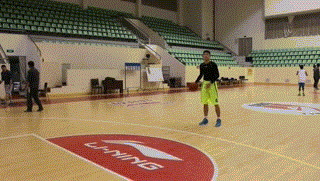

胯下背绕式组合运球

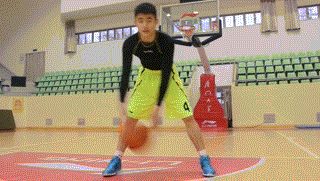

延伸膝盖宽度运球

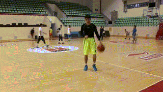

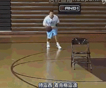

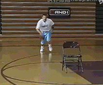

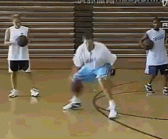

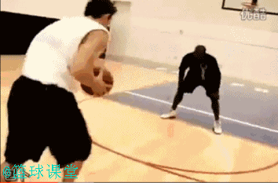

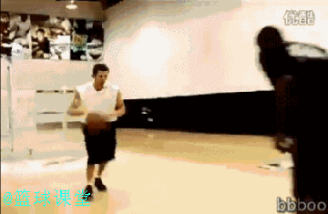

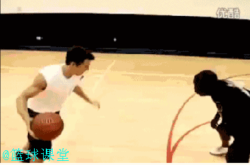

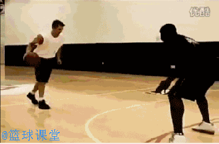

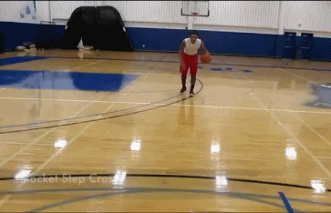

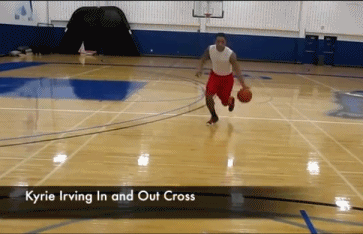

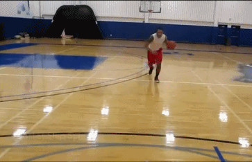

## 过人

cross over

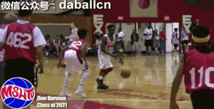

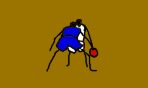

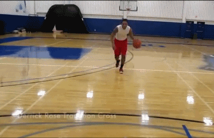

拜佛

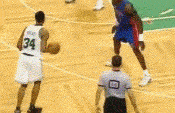

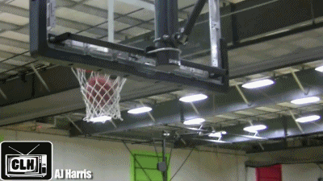

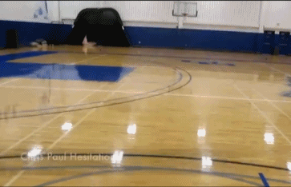

交叉步

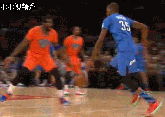

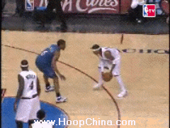

过人

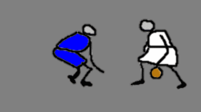

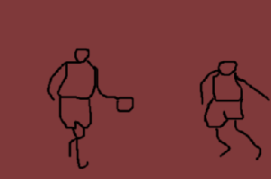

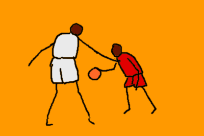

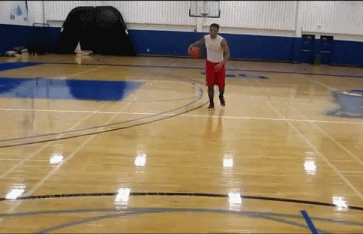

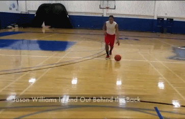

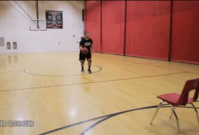

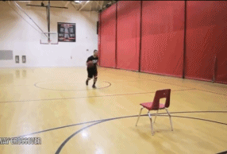

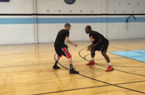

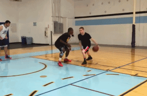

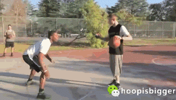

交叉步

拜佛

## 中投

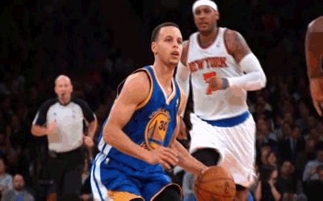

1.垫脚屈膝。2 翘臀。3 斜背。4 球在胸或腰的shot pocket。 5 球起人起，跳投

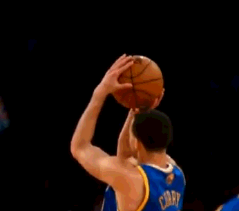

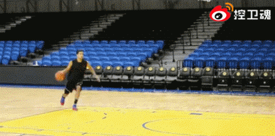

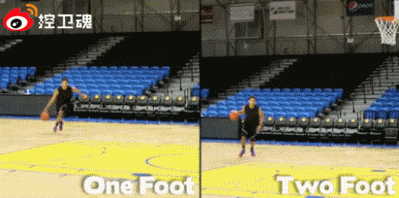

## 连贯动作

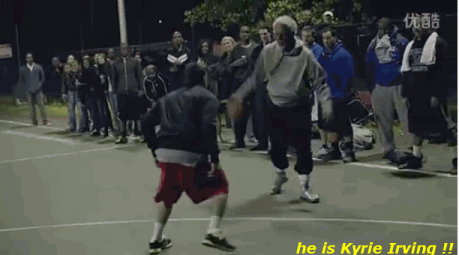

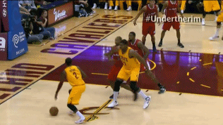

